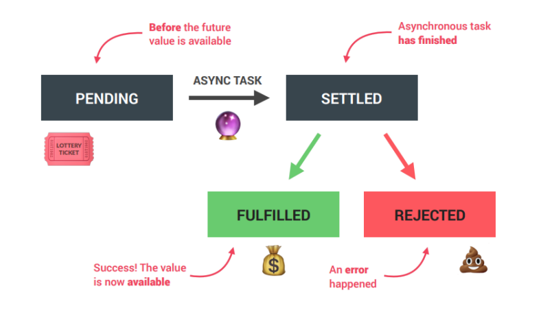

# SYNCHRONOUS
1. Most code is synchronous
1. synchronous code is executed line by line
1. Each line of code waits for previous line to finish
1. long-running operations block code execution

# ASYNCHRONOUS
1. Asynchronous code is executed after a task that runs
1. Asynchronous code is non-blocking
1. Execution doesn't wait for an asynchronous task to finish its work
1. Callback functions alone do NOT make code asynchronous!

# ASYNCHRONOUS VS SYNCHRONOUS
    console.log('One')
    console.log('Two')
    console.log('Three')
    //LOGS: 'One', 'Two', 'Three'
    ////////////////////////////////////////////////
    console.log('One')
    setTimeout(() =>
    console.log('Two'), 100)
    console.log('Three')
    //LOGS: 'One', 'Three', 'Two'

# ASYNCHRONOUS
Asynchronous code in JavaScript can be written using
1. callbacks,
1. promises,
1. async/await syntax
Asynchronous Callbacks are functions that are passed as arguments to other functions and are executed when the called
function completes its task. Callbacks can be used to handle asynchronous operations by passing a callback
function to an asynchronous method, which then calls the callback function when the operation is complete.

        function foo(callback) {
            setTimeout(function() {
                callback('Hello world!')
            }, 1000)
        }
        
        foo (function(value) {
            console.log(value)    
        })

# NEW PROMISE IN JAVASCRIPT
In JavaScript, a promise is a good way to handle asynchronous operations. It is used to
find out if the asynchronous operation is successfully completed or not.

A promise may have one of three states
1.  Pending
1. Fulfilled
1. Rejected

# promise
A promise starts in a
pending state. That means
the process is not
complete. If the operation is
successful, the process
ends in a fulfilled state.
And, if an error occurs, the
process ends in a rejected
state.

To create a promise object, we use the Promise() constructor.

    let promise = new Promise(function(resolve, reject) {
        //do something 
    })

The Promise() constructor takes a function as an argument. The function also
accepts two functions resolve() and reject().
If the promise returns successfully, the resolve() function is called.
And, if an error occurs, the reject() function is called.

    function bar () {
        return new Promise(function(resolve, reject) {
            setTimeotut(function() {
                resolve('Hello world!')
            }, 1000)
        })
    }

    bar().then(function(value) {
        console.log(value)
    }).catch(function(error) {
        console.log(error)
    })

# TRY / CATCH / finally
The try, catch and finally blocks are used to handle exceptions (a type of an error). Before you learn
about them, you need to know about the types of errors in programming.

    const numerator = 100, denominator = 'a';

    try {
        console.log(numerator / denominator)
        console.log(a)
    }
    catch (error) {
        console.log('An error caught')
        console.log('Error message: ' + error)
    }
    finally {
        console.log('Finally will execute every time')
    }

# Async function
We use the async keyword with a function to represent that the function is an
asynchronous function. The async function returns a promise.
The syntax of async function is:

    async function name (parameter1, parameter2, ...parameterN) {
        // statements
    }

Async await
There is a special syntax for dealing with promises called "async/await". It is surprisingly easy to
understand and use.
The await keyword will cause the JavaScript interpreter to wait until the promise to the right of await
is fulfilled. After that, it will return its result, and code execution will continue.

    async function baz() {
        return new Promise(function(resolve, reject) {
            resolve('Hello world!')
        }, 1000)
    }

    (async function() {
        try {
            const value = await baz()
            console.log(value)
        }catch(error) {
            console.error(error)
        }
    })()

